# Performance Profiling

## Optimization Summary

1. **Country Search**: 100.7ms → 40.6ms - **60% improvement**
2. **Region Filter**: 91.9ms → 37.3ms - **59% improvement**
3. **Year Filter**: 135.2ms → 77ms - **43% improvement**
4. **Sorting (Population)**: 115ms → 82.5ms - **28% improvement**
5. **Coal CO2 Column**: 197ms → 147.3ms - **25% improvement**
6. **Country Details**: 150ms → 123.5ms - **18% improvement**
7. **Initial Render**: 68.1ms → 84.4ms - **24% slower**

---

## Before Optimization

### Initial Render Performance

- **Commit time**: 1.2s
- **Render time**: 68.1ms
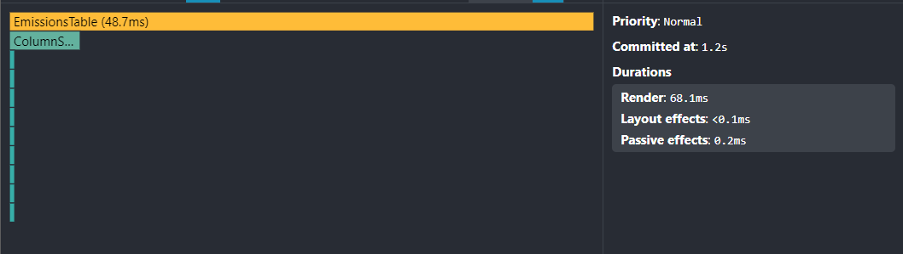

### Country Details Performance

- **Commit time**: 0.9s
- **Render duration**: 150ms
- **Trigger**: User clicking row

## All further tests were performed with details panel open

### Sorting Performance (Population Column)

- **Commit time**: 1.1s
- **Render duration**: 115ms
- **Trigger**: User clicking column header

### Filtering Performance (Region Filter)

- **Commit time**: 1.2s
- **Render duration**: 91.9ms
- **Trigger**: Changing region filter

### Year Filter Performance

- **Commit time**: 1.1s
- **Render duration**: 135.2ms
- **Trigger**: Changing year filter

### Country Search Performance

- **Commit time**: 2.6s
- **Render duration**: 100.7ms
- **Trigger**: New input in search field

### Coal CO2 Column Performance
- **Commit time**: 1.5s
- **Render duration**: 197ms
- **Trigger**: Enabling coal_co2 column in details

---

## After Optimization

### Initial Render Performance

- **Commit time**: 1.3s
- **Render time**: 84.4ms
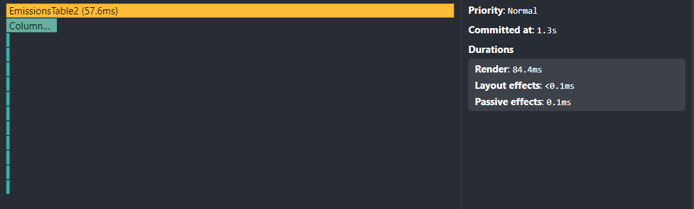
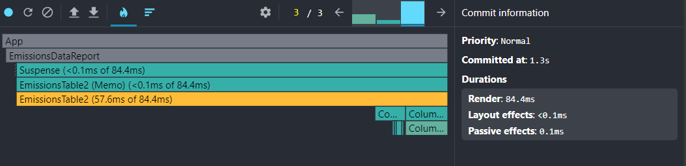

### Country Details Performance

- **Commit time**: 0.6s
- **Render duration**: 123.5ms
- **Trigger**: User clicking row
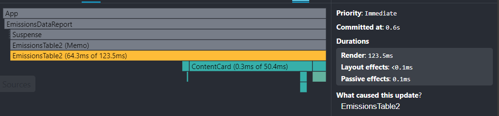
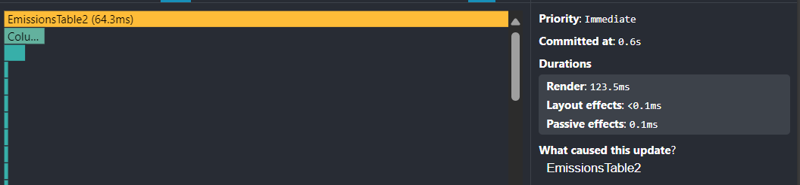

## All further tests were performed with details panel open

### Sorting Performance (Population Column)

- **Commit time**: 0.6s
- **Render duration**: 82.5ms
- **Trigger**: User clicking column header
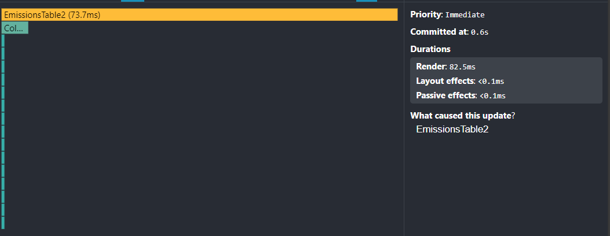
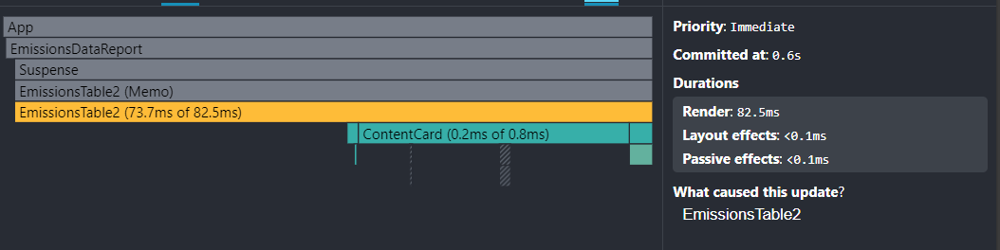

### Filtering Performance (Region Filter)

- **Commit time**: 1.2s
- **Render duration**: 37.3ms
- **Trigger**: Changing region filter
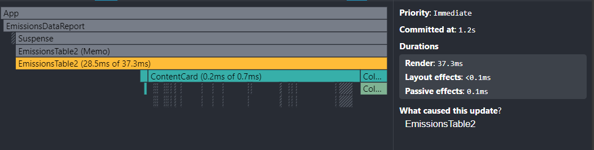
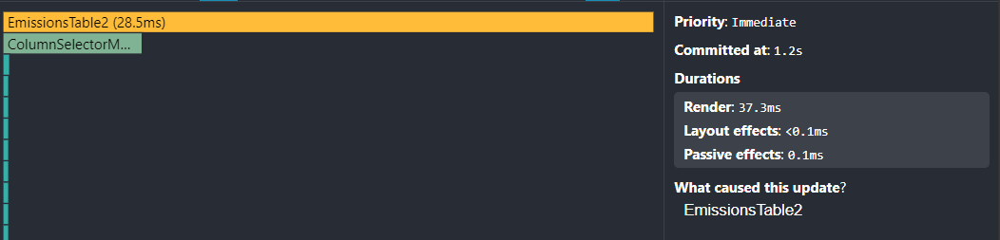

### Year Filter Performance

- **Commit time**: 1.0s
- **Render duration**: 77ms
- **Trigger**: Changing year filter
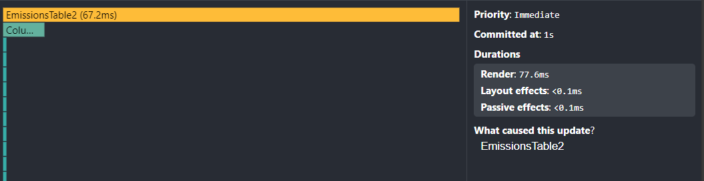
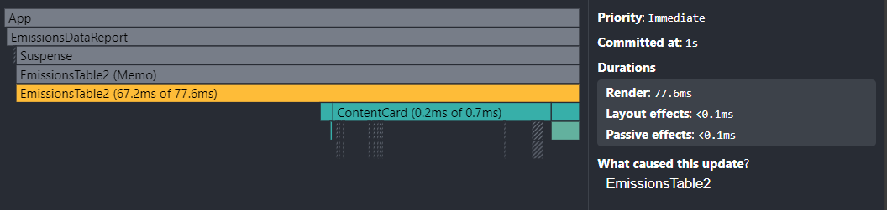

### Country Search Performance

- **Commit time**: 1.0s
- **Render duration**: 40.6ms
- **Trigger**: New input in search field
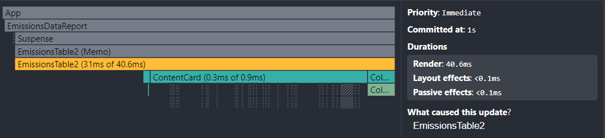
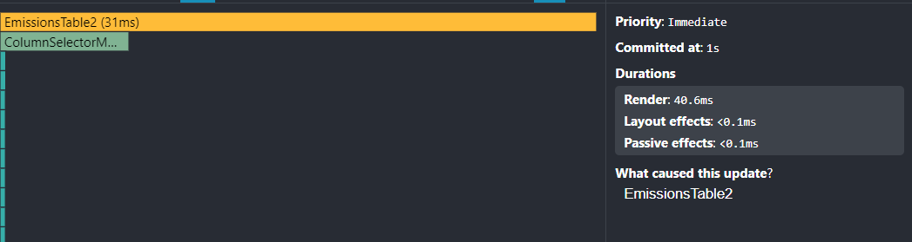

### Coal CO2 Column Performance
- **Commit time**: 1.5s
- **Render duration**: 147.3ms
- **Trigger**: Enabling coal_co2 column in details
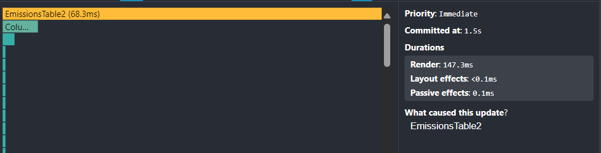
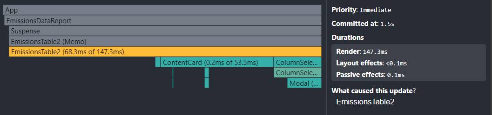