# Performance Profiling

## Before Optimization

### Initial Render Performance

- **Commit time**: 1.4s
- **Render time**: 61.5ms
  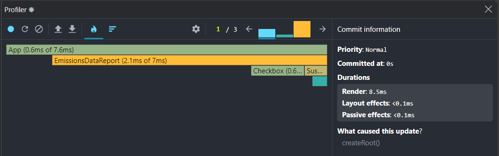

### Sorting Performance (Population Column)

- **Commit time**: 1.0s
- **Render duration**: 67ms
- **Trigger**: User clicking column header
  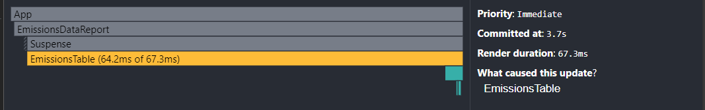
  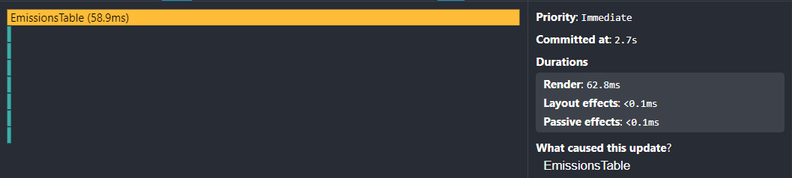

### Country Details Performance

- **Commit time**: 1.2s
- **Render duration**: 93ms
- **Trigger**: User clicking row
  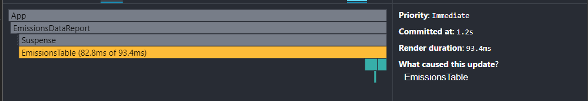
  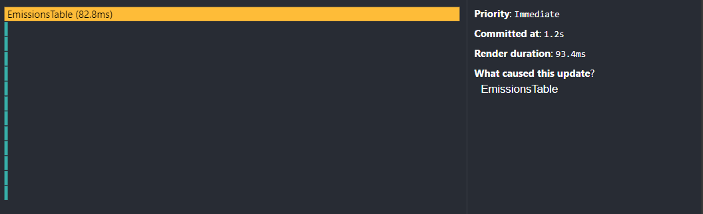

### Filtering Performance (Region Filter)

- **Commit time**: 1.3s
- **Render duration**: 24.2ms
- **Trigger**: Changing region filter
  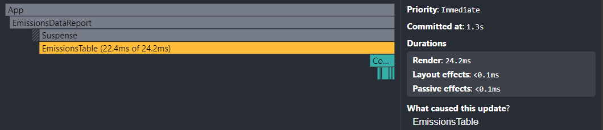
  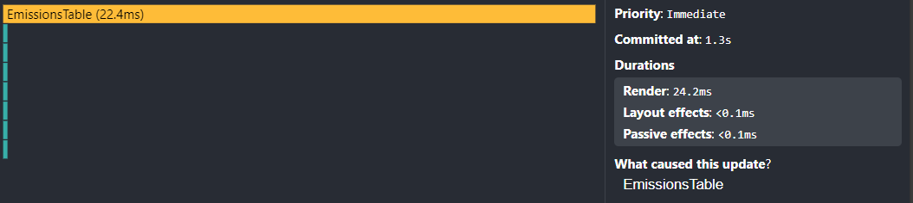

### Year Filter Performance

- **Commit time**: 1.0s
- **Render duration**: 56.3ms
- **Trigger**: Changing year filter
  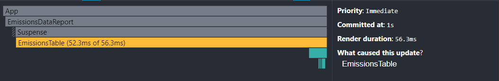
  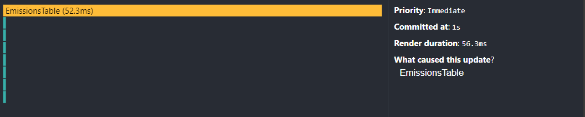

### Country Search Performance

- **Commit time**: 1.4s
- **Render duration**: 30.7ms
- **Trigger**: New input in search field
  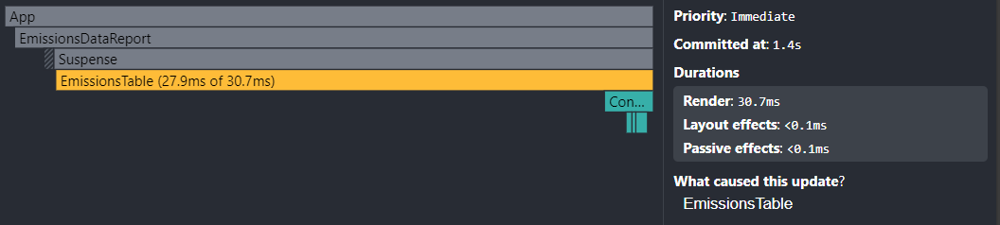
  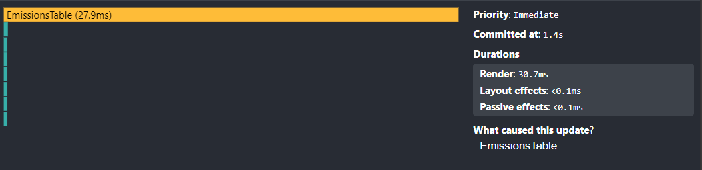

---

## After Optimization
